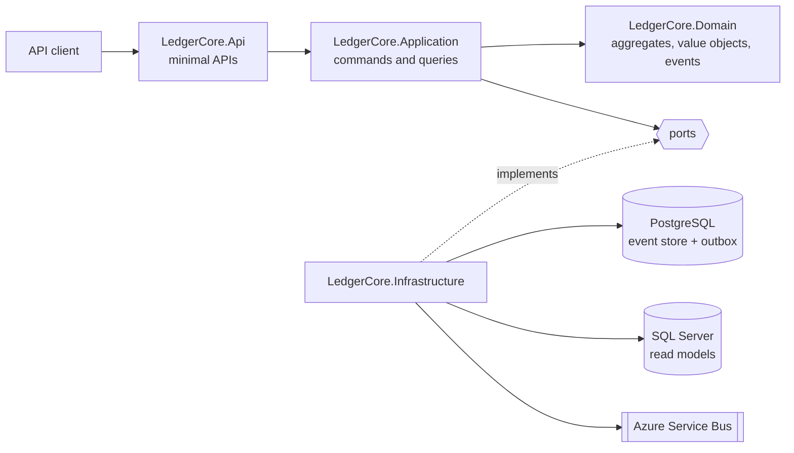

# LedgerCore

[](https://github.com/softvasco/ledger-core/actions/workflows/ci.yml)
[](LICENSE)

An event-sourced, double-entry banking ledger in .NET 10. Every movement debits one account and credits another, nothing is ever updated in place, and any balance can be rebuilt from the events that produced it.

Work in progress. The domain model and the PostgreSQL event store are in place; the API and messaging are next.

## Why

In a lot of banking software the balance is a column that gets overwritten, and the audit trail is a separate table you hope is complete. When a number looks wrong, working out how it got there is slow and painful.

A ledger built on events turns that around. The events are the record, the balance is derived from them, and the history is the same thing as the audit. Double entry adds the rule that money never appears or disappears: for every posting, debits equal credits.

This repo is my take on how that should look in modern .NET, without a framework hiding the interesting parts.

## Features

Done:
- `Money` and `Currency` value objects: no mixing currencies, no amounts finer than the currency settles in, banker's rounding on multiplication.
- `Iban` with per-country length and mod-97 check, and a strongly typed `AccountId` (time-ordered v7 Guid).
- `Account` aggregate (open, freeze, unfreeze, close) built from its events on a small aggregate root with versioning.
- Journal entries of two or more postings that must balance in every currency, checked with FsCheck property tests ([ADR-0004](docs/adr/0004-double-entry-bookkeeping-model.md)).
- Business rule failures come back as `Result` with stable error codes; exceptions are kept for bugs ([ADR-0003](docs/adr/0003-results-for-business-rule-failures.md)).
- Event store on a single PostgreSQL table: optimistic concurrency per stream, and a global position that readers can follow without skipping a late commit.
- Snapshots every N events (100 by default). They are only a cache: a missing or unreadable snapshot just means a longer replay.

Coming next:
- CQRS with a small hand-written dispatcher, minimal API with ProblemDetails and idempotency keys.
- Transfers as a process manager, transactional outbox, Azure Service Bus.
- Read models on SQL Server, .NET Aspire, OpenTelemetry, and a Blazor back office.

## Architecture



The Domain project has no dependencies at all. Application talks to the outside world only through interfaces it owns, and Infrastructure implements them. Design decisions are in [docs/adr](docs/adr/README.md), starting with [why the ledger is event sourced](docs/adr/0002-event-sourcing-for-the-ledger.md).

## Quickstart

For now:

```bash
dotnet build
dotnet test
```

Needs the .NET 10 SDK, and Docker for the PostgreSQL tests (Testcontainers starts the database). A one-command run with .NET Aspire comes once there is infrastructure to run.

## License

MIT
